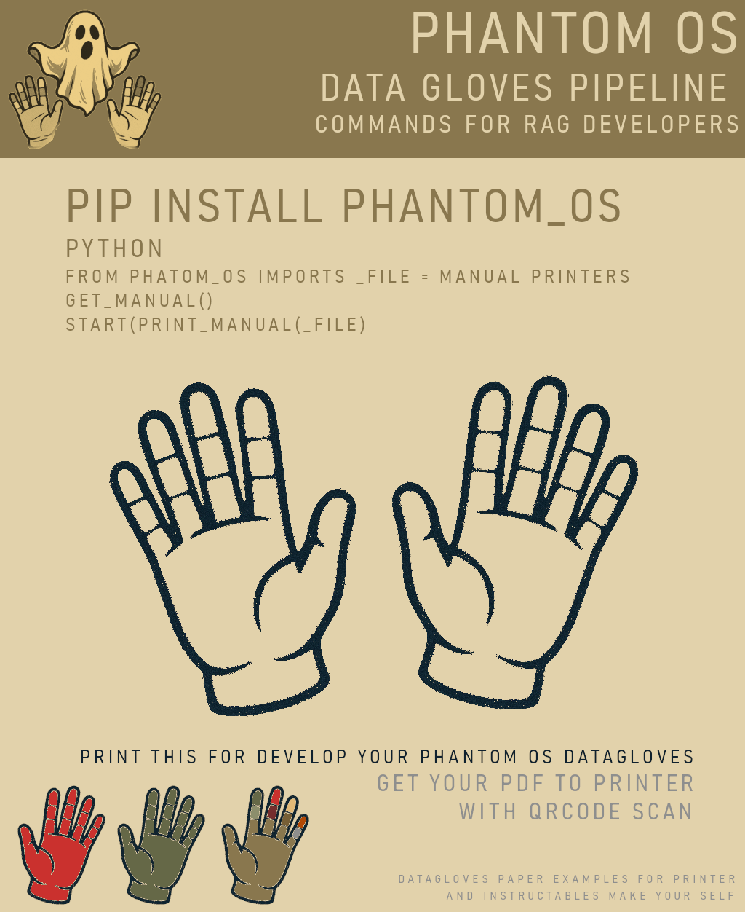
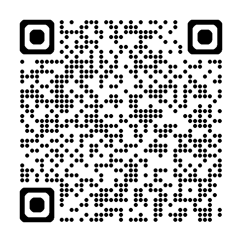

# PHANTOM-OS DATAGLOVE – Manual for RAG Developers
**Build your own virtual drivers for DATAGLOVES to manage PC Visual Systems** 

#like the modern graphics systems virtual drivers by phantom-os datagloves


**Version:** 0.1 (Under Construction)  
**Author:** @asytrick (eusmool@gmail.com)  
**Repository:** [github.com/ssmool](https://github.com/ssmool)  

---

## 📖 Overview

The **PHANTOM-OS DATAGLOVE** is a **virtual plug-and-play driver system** for gesture-based control using **colored gloves**.  
It integrates with **LIONS MAPPER** to detect RGB patterns from **webcam feeds** or **video files**, mapping gestures to mouse and keyboard actions.  

---

## 1️⃣ Installation

### Requirements
- Python 3.8+
- Webcam or compatible video input
- Colored gloves for tracking

Install dependencies:
```bash
pip install tkinter keyboard pyautogui pillow lionsmapper
````

or

```bash
pip install phantomos
````

---

## 2️⃣ Configuration

### 2.1 Screen Selection

```python
set_ecran(ecran_src=0)  
# 0 = primary monitor
# 1 = secondary monitor, etc.
```

### 2.2 Keyboard Mapping

```python
set_keyboard(_axis)               # Assigns key for pressing
set_keyboard_return(_axis)        # Assigns backspace key
find_map_keyboard(_x, _y, _value) # Map a key by cursor position
```

### 2.3 Mouse Mapping

```python
set_mouse({"x": 0, "y": 0})  # Moves the cursor to given coordinates
```

### 2.4 Virtual Interfaces

```python
open_virtual_keyboard()  
# Opens a keyboard window from keyboard.png

open_virtual_mouse(
    RGB_DATAGLOVE_LEFT, RGB_DATAGLOVE_RIGHT,
    RGB_LEFT_CLICK, RGB_RIGHT_CLICK,
    RGB_SCROLL_DOWN, RGB_SCROLL_UP, RGB_CURSOR
)
# Links gestures to mouse actions
```

---

## 3️⃣ Data Glove Settings

Edit `data_glover.py`:

```python
set_dataglove_side("LEFT")  # LEFT or RIGHT

LEFT_GLOVE = {
    "FINGER_1": "255,0,0",  # Red
    "FINGER_2": "0,255,0",  # Green
    "FINGER_3": "0,0,255",  # Blue
    "FINGER_4": "255,255,0",# Yellow
    "FINGER_5": "255,0,255" # Magenta
}
```

Retrieve settings:

```python
get_dataglove()
get_dataglove_cursor()
```

---

## 4️⃣ Starting the Driver

```python
start_dataglove()
```

---

## 5️⃣ Example – Left Glove Cursor Control

```python
set_ecran(0)
set_mouse({"x": 100, "y": 200})
open_virtual_mouse(
    RGB_DATAGLOVE_LEFT="255,0,0",
    RGB_DATAGLOVE_RIGHT="0,255,0",
    RGB_LEFT_CLICK="0,0,255",
    RGB_RIGHT_CLICK="255,255,0",
    RGB_SCROLL_DOWN="128,128,128",
    RGB_SCROLL_UP="64,64,64",
    RGB_CURSOR="0,255,255"
)
start_dataglove()
```

---

## 6️⃣ Troubleshooting

* **Glove not detected:** Check RGB values match your glove colors exactly.
* **Cursor lag:** Reduce webcam resolution or increase `max_frame_rate`.
* **Keyboard not mapping:** Ensure `keyboard.png` exists in your assets folder.


## 6️⃣ Troubleshooting:

* **MAKE YOUR DATAGLOVE CRAFTER WITH PRINTABLE PAPER FILE TO CUT AND PASTE FOR GESTURE RECOGNIZE WITH THE PASTED DATAGLOVE PAPER'S WEARS



---

## 📩 SCAN FOR DOWLOAD THE PRINTABLE FILE:

* **SCAN FOR DOWNLOAD THE PRINTABLE FILE:


---

## 📩 Contact

Author: **@asytrick**
Email: **[eusmool@gmail.com](mailto:eusmool@gmail.com)**
Repo: **[https://github.com/ssmool](https://github.com/ssmool)**


